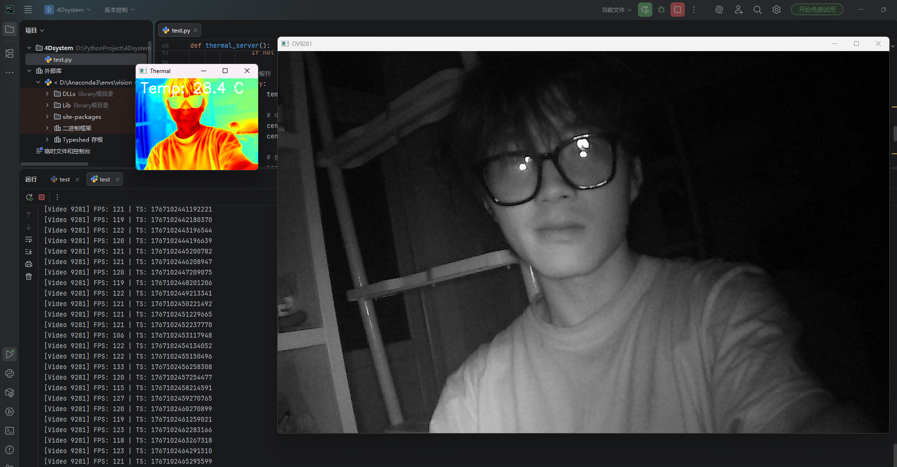

# 树莓派双目采集传输系统 - 开发工作摘要

日期：2025-12-30

平台：Raspberry Pi 4B

目标：实现双路相机（高速可见光 + 热成像）的高帧率、低延迟、抗干扰传输。



## 今日工作复盘 

### 1. 核心性能突破

- **OV9281 高速相机**：
  - 摒弃了 OpenCV 解码再编码的低效方案，重写为 **V4L2 Native 驱动**。
  - 直接透传 MJPG 压缩流，成功实现 **1280x800 @ 120FPS** 稳定传输，带宽占用仅约 150Mbps。
- **Tiny1-C 热成像**：
  - 解决了 SDK 初始化时未分配温度帧内存导致的 **“数据乱码”** 问题。
  - 解决了主线程 `sleep(1)` 导致的 SDK 采集阻塞，将帧率从 **1FPS 提升至 30FPS (满帧)**。
  - 实现了 **双缓冲发送策略**（Local Buffer Copy），在网络发送期间立即释放 SDK 信号量，确保持续采集不掉帧。

### 2. 系统鲁棒性

- **黑匣子模式支持**：
  - 屏蔽了 `SIGPIPE` 信号，解决了 **“拔网线程序崩溃”** 的问题。
  - 实现了 TCP **断线自动重连**机制，支持热插拔，即插即用。
  - 配置了 Systemd 服务，支持上电自启。

------

## 通信协议说明

为了保证两路数据的时间同步，我们定义了一套统一的 **16字节包头 (Header)** 协议。

### 1. 网络拓扑

- **协议**：TCP Socket
- **IP 地址**：
  - 树莓派 (Server/Sender): `192.168.1.101` (动态连接 PC)
  - 电脑 (Client/Receiver): `192.168.1.100` (静态 IP)
- **端口分配**：
  - **8888**：OV9281 高速视频流
  - **8889**：Tiny1-C 热成像数据流

### 2. 数据包结构

所有数据包均由 **包头 + 载荷** 组成：

| **字段**       | **长度**     | **类型**   | **字节序**    | **说明**                          |
| -------------- | ------------ | ---------- | ------------- | --------------------------------- |
| **Header**     | **16 Bytes** |            |               | **统一包头**                      |
| `timestamp_us` | 8 Bytes      | `uint64_t` | Little Endian | 微秒级采集时间戳 (用于 4DGS 对齐) |
| `data_size`    | 4 Bytes      | `uint32_t` | Little Endian | 后续 Payload 的字节长度           |
| `frame_id`     | 4 Bytes      | `uint32_t` | Little Endian | 帧序号 (用于检测丢帧)             |
| **Payload**    | **N Bytes**  |            |               | **数据载荷** (见下文)             |

------

## 三、 数据解析与调用指南 (Usage Guide)

### 1. OV9281 视频流 (Port 8888)

- **载荷类型**：MJPG 压缩图片数据

- **数据处理**：

  1. 读取 `data_size` 长度的字节流。
  2. 直接送入解码器（如 OpenCV `imdecode`）。

- **Python 解析示例**：

  Python

  ```
  # 1. 解析包头
  header = recv_bytes(16)
  ts, size, fid = struct.unpack("=QII", header)
  
  # 2. 接收 Payload
  jpg_data = recv_bytes(size)
  
  # 3. 解码显示
  img = cv2.imdecode(np.frombuffer(jpg_data, np.uint8), cv2.IMREAD_GRAYSCALE)
  print(f"Time: {ts}, FPS: {fid}")
  ```

### 2. Tiny1-C 热成像流 (Port 8889)

- **载荷类型**：原始温度数据数组 (Raw Temperature Array)

- **分辨率**：256 (宽) x 192 (高)

- **数据格式**：`uint16_t` (每个像素 2 字节)

- **固定大小**：`256 * 192 * 2 = 98304 Bytes`

- 温度转换公式：

  

  $$T_{摄氏度} = \frac{RawValue}{64.0} - 273.15$$

- **Python 解析示例**：

  Python

  ```
  # 1. 解析包头
  header = recv_bytes(16)
  ts, size, fid = struct.unpack("=QII", header)
  
  # 2. 接收 Payload (必须严格等于 98304)
  raw_bytes = recv_bytes(size)
  
  # 3. 转换为 Numpy 数组
  # 注意：dtype 必须是 uint16
  temp_grid = np.frombuffer(raw_bytes, dtype=np.uint16).reshape((192, 256))
  
  # 4. 获取中心点温度
  center_raw = temp_grid[192//2, 256//2]
  real_temp = (center_raw / 64.0) - 273.15
  print(f"Center Temp: {real_temp:.2f}°C")
  ```

